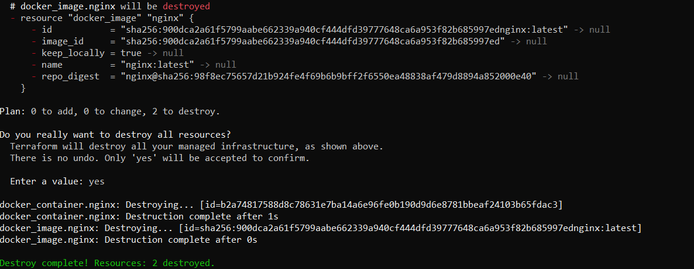

We are gonna to use **PowerShell** to install Terraform via **choco** package manager and use preconfigured **aliases**

- [Creating aliases for PowerShell](#create_aliases)
- [Installing choco and terraform](#choco_install)
- [Terraform initial simple project](#terraform_project)

### <a name="create_aliases">Creating aliases for PowerShell</a>  

Check in psh path to the profile `$PROFILE`

```
C:\Users\User\Documents\WindowsPowerShell\Microsoft.PowerShell_profile.ps1
```
create the file if it doesn't exist, e.g. with command `notepad $PROFILE`

paste the content of the terra_on_docker\psh_aliasses.txt file to it. Restart psh.

### <a name="choco_install">Installing choco and terraform</a>  


From the [Choco docs](https://docs.chocolatey.org/en-us/choco/setup/)

Run `Get-ExecutionPolicy`.

If it returns Restricted, then run `Set-ExecutionPolicy AllSigned` or `Set-ExecutionPolicy Bypass -Scope Process`.
#### NOTE! Chocolatey and the Terraform package are NOT directly maintained by HashiCorp. The latest version of Terraform is always available by manual installation.

Then run

`choco install terraform`

Verify it installed

`terraform -version`
```
Terraform v1.9.4
on windows_amd64
```

### <a name="terraform_project">Terraform initial simple project</a>  

Create a directory *terra_on_docker* on your local machine.

This working directory houses the configuration files that you write to describe the infrastructure you want Terraform to create and manage. When you initialize and apply the configuration here, Terraform uses this directory to store required plugins, modules (pre-written configurations), and information about the real infrastructure it created.

Look at https://github.com/kreuzwerker/terraform-provider-docker 
and use example from readme to create main.tf file inside the directory

Use `terraform init` (`tfi` with applied aliases) to Initialize the project, which downloads a plugin called a provider that lets Terraform interact with Docker. It will create also .terraform directory with its files.

Then you can run `tfa` to make terraform create docker container with nginx

check that container exist `docker ps`

go to localhost:8000 and check that server runs

perform `tfd` to destroy container.


